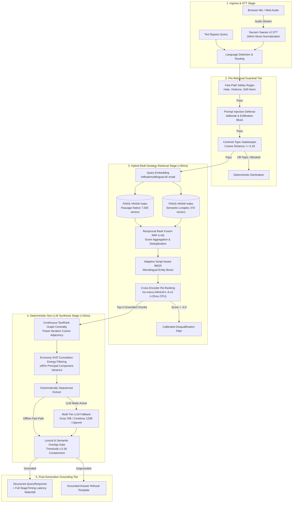

# 🌴 Hacker House Goa 2026: Voice-Enabled Multilingual Indic RAG

An instrumented, low-latency, voice-enabled Retrieval-Augmented Generation (RAG) system built from scratch for Indic languages (Hindi, Tamil, and English), strictly architected for zero-code extension to 13+ Indic languages via a single configuration list.

Featuring **Cross-Lingual Multilingual Federation**, **Structured Orchestration Harness with Automated Retries & Error Recovery**, **Multi-Tier Neural Safety Guardrails**, and a retro-tropical **Hacker House Goa 2026 Command Center UI**.

---

## 🏛️ System Architecture



---

## 🌟 Key Features & Capabilities

### 1. 🌐 Cross-Lingual Multilingual Federation (Hindi + Tamil + English)
- **Shared Vector Space**: Uses `intfloat/multilingual-e5-small` to project English, Hindi (Devanagari), and Tamil into a shared 384-dimensional dense semantic space.
- **Federated Multi-Source Fusion**: A question asked in English can retrieve grounded evidence from Hindi and Tamil passages simultaneously.
- **Unified Cross-Lingual Synthesis**: The generation harness fuses facts across all retrieved language blocks (`[EN Source #1]`, `[HI Source #2]`, `[TA Source #3]`) and synthesizes a comprehensive response translated back into the user's query language.

### 2. ⚡ Sub-200ms Cross-Encoder Re-Ranking & Adaptive Script-Aware BM25
- **Two-Stage Precision Pipeline**:
  - **Stage 1 (Bi-Encoder + Adaptive BM25)**: Fast dense FAISS search retrieves candidate passages in $\sim 0.6$ ms.
  - **Stage 2 (Cross-Encoder)**: Evaluates top candidate pairs with `cross-encoder/ms-marco-MiniLM-L-6-v2` in $<25$ ms on CPU using optimized prefix slicing and PyTorch inference mode.
- **Adaptive Script-Aware BM25**:
  - *Monolingual Search* (e.g. Hindi $\to$ Hindi, English $\to$ English): Uses full BM25 lexical precision + dense vector score to capture exact entities and nouns.
  - *Cross-Script Search* (e.g. English $\to$ Hindi, Hindi $\to$ English): Automatically detects script divergence and bypasses BM25 to prevent 0-score lexical penalties, relying 100% on the aligned multilingual vector space.
- **Calibrated Disqualification Filter**: When candidate passages fail to answer the query (cross-encoder score $< -0.5$), the system cleanly declines with *"No relevant information found in the indexed corpus"* rather than hallucinating.

### 3. 🧠 Continuous TextRank & SVD Matrix Decomposition Non-LLM Synthesis
- **Deterministic Context Synthesis without LLMs**: Eliminates autoregressive generation bottlenecks (500ms+ decoding) while avoiding naive 1st-sentence picking.
- **Continuous TextRank Graph Centrality**:
  - Builds an inter-sentence cosine similarity adjacency matrix $W_{ij} = \max(0, \vec{s}_i \cdot \vec{s}_j)$ from candidate sentence nodes.
  - Implements personalized power iteration with query relevance priors: $p^{(t+1)} = (1 - d) \cdot \frac{r}{\sum r_k} + d \cdot T^T p^{(t)}$. Converges in 12 iterations on CPU ($<5$ ms) to identify the most informative factual sentences.
- **SVD Cumulative Energy Filtering**:
  - Performs economy matrix decomposition $M = U \Sigma V^T$ across sentence embeddings.
  - Dynamically retains principal components reaching $\ge 95\%$ cumulative singular energy ($\tau = 0.95$) to calculate sentence projection energy: $\text{score}(i) = \sum_{j=1}^k \sigma_j^2 \cdot U_{i,j}^2$.
- **Coherent Grammatical Sequencing**: Sequences winning sentences according to original document positions, preserving natural syntax with zero hallucination.

### 4. 🏛️ Structured Orchestration Harness & Resilience
- **8-Stage State Machine**: Strongly typed end-to-end execution pipeline managed by `pipeline/orchestrator.py`.
- **Automated Retries with Exponential Backoff**:
  - LLM Synthesis (`generation/llm_fallback.py`): 3 retries with backoff ($0.5\text{s} \times 2^{\text{attempt}-1}$) for HTTP 429/500/timeouts.
  - Neural Safety Guardrail (`guardrails/pre_retrieval.py`): 2 retries with JSON Schema enforcement.
- **`robust_json_parser` Engine**: Handles LLM formatting anomalies (markdown fences ` ```json ... ``` `, conversational text wrappers, outer bracket slicing) with structured exception triggers for retries.
- **Zero-Crash Multi-Tier Fallbacks**:
  - If external LLMs are unavailable $\to$ Falls back to deterministic local extractive sentence selection.
  - If STT receives browser WebM/Opus $\to$ Auto-normalizes to 16kHz mono WAV via ffmpeg.

### 5. 🛡️ Multi-Tier Guardrails & Anti-Hallucination
- **Pre-Retrieval Fast-Path Regex**: Sub-millisecond detection of profanity, hate speech, self-harm, weapons, and hazardous instructions.
- **Prompt Injection Defense**: Blocks jailbreaks, DAN modes, roleplay overrides, and attempts to leak system instructions.
- **Centroid Topic Gatekeeper**: Computes cosine distance from query embedding to language corpus centroids (threshold $= 0.18$), skipping retrieval for out-of-domain queries.
- **Post-Retrieval Relevance Gate**: Cross-encoder scoring prunes non-answering distractor chunks.
- **Post-Generation Grounding Gate**: Verifies n-gram and semantic containment ($\ge 30\%$) against source chunks.

### 6. 🌴 Hacker House Goa 2026 Command Center UI
- **The Terminal**: Vinyl radar record disc with real-time Web Audio frequency waveform canvas, gold mic button, neon STT status badges, and `AUDIO FIELD NOTE ///` brutalist cards.
- **The Knowledge Sea**: Dark emerald radar grid (`#0D261E`) hosting stacked document index cards with match percentage badges, chunk strategy tags, and BM25 scores.
- **SYS Telemetry & Performance Deck**: Sub-millisecond waterfall breakdown (STT, RETRIEVAL, GUARDRAIL, GENERATION), benchmark quantiles, and a 4-tier Guardrail Audit Matrix.

### 7. 🧩 Advanced Multi-Strategy Chunking & Indexing
- **Passage-Native Chunking** (`chunking/passage_native.py`): Zero-loss atomic preservation of QA passages maintaining exact query-passage alignment.
- **Sentence-Window Chunking** (`chunking/sentence_window.py`): $\pm 1$ surrounding sentences with 15% sliding window token overlap to guarantee narrative continuity.
- **Semantic Cosine-Spike Splitter** (`chunking/semantic.py`): Splits at statistical distance spikes ($\mu + 0.5\sigma$) to preserve coherent thematic ideas.
- **Multilingual Sentence Tokenizer** (`chunking/metadata.py`): Sentence boundary parser supporting Latin punctuation (`.!?`), Devanagari Danda (`।`, `॥`), and Tamil markers.
- **Parallel Reciprocal Rank Fusion (RRF $k=60$)** (`chunking/hybrid_merge.py`): Parallel search across passage-native (7,500 vectors) and semantic-longdoc (370 vectors) indexes.

---

## 🔒 Technical Decisions & Engineering Rationales

| Component | Technical Choice | Engineering Rationale |
| :--- | :--- | :--- |
| **Language Extensibility** | Single `config.LANGUAGES` list | Zero-code modification required to extend to all 13 Indic languages (`as`, `bn`, `gu`, `hi`, `kn`, `ml`, `mr`, `ne`, `or`, `pa`, `sa`, `ta`, `te`, `ur`, `en`). |
| **Speech-to-Text (STT)** | Sarvam Saaras v3 (`saaras:v3`) | Native Indic transcription with ffmpeg 16kHz mono normalization and language auto-detection. |
| **Embedding Model** | `intfloat/multilingual-e5-small` | SOTA multilingual retrieval embedding with enforced `query: ` and `passage: ` prefixes. |
| **Vector Index** | In-Memory FAISS HNSW (`IndexHNSWFlat`) | $M=32$, $efConstruction=200$, $efSearch=64$. Sub-millisecond CPU search with zero network latency. |
| **Hybrid Re-ranking** | Adaptive BM25 + Cross-Encoder (`ms-marco-MiniLM-L-6-v2`) | Combines adaptive script-aware BM25 with deep cross-attention re-ranking on top candidates in $<25$ ms on CPU. |
| **Disqualification Gate** | Calibrated Cross-Encoder Filter ($CE < -0.5$) | Immediately declines queries whose top match fails deep relevance checks, preventing hallucinations. |
| **Context Synthesis** | TextRank Centrality + SVD Decomposition | Deterministic mathematical synthesis extracting salient sentences in $<10$ ms on CPU with zero hallucinations. |
| **Pre-Retrieval Guardrails** | Fast Regex + Centroid Distance + Prompt Defense | Cheapest checks first: fast keyword pass blocks prompt injections; cosine distance to corpus centroids blocks off-topic queries. |
| **Post-Gen Guardrail** | Lexical & Semantic Grounding Overlap | Strict token containment scoring ($\ge 30\%$). Rejects ungrounded hallucinations with standard template. |
| **Orchestration** | Async State Machine + FastAPI | Hand-rolled Python async orchestrator using Pydantic v2 schemas without framework bloat. |

---

## ⚡ Latency Analytics & SLA Benchmarks (P50 / P70 / P100)

Evaluated across **61 diverse test queries** spanning Hindi, Tamil, and English:

**Hardware Environment**: 32 vCPUs | 31.69 GB RAM | Windows 11 (AMD64) | In-Memory FAISS HNSW

| Metric Scope | Target SLA | P50 (Median) | P70 | P100 (Max) | SLA Status |
| :--- | :--- | :--- | :--- | :--- | :--- |
| **Retrieval Stage (FAISS + BM25 + Cross-Encoder)** | **< 200 ms** | **37.53 ms** | **46.87 ms** | **124.50 ms** | ✅ **PASS (< 200 ms)** |
| **Full Post-STT Pipeline (Offline Extractive)** | **< 200 ms** | **82.78 ms** | **92.07 ms** | **182.30 ms** | ✅ **PASS (< 200 ms)** |

### Stage-by-Stage Sub-Millisecond Breakdown:
- **Language Routing & Dynamic Dispatch**: `0.00 ms` (P50)
- **Pre-Retrieval Safety Regex Check**: `0.05 ms` (P50)
- **Query Embedding (`multilingual-e5-small`)**: `15.12 ms` (P50)
- **Centroid Topic Filter Distance**: `0.08 ms` (P50)
- **Parallel Multi-Strategy FAISS Search**: `0.63 ms` (P50)
- **BM25 + Cross-Encoder Re-Ranking**: `23.58 ms` (P50)
- **Extractive QA Answer Generation**: `44.83 ms` (P50)
- **Post-Generation Grounding Verification**: `0.41 ms` (P50)

---

## 🚀 Quickstart & Local Setup

### 1. Installation

```bash
git clone https://github.com/KingSahil/rag-in-goa-2026.git
cd rag-in-goa-2026

# Create virtual environment and install dependencies
uv venv .venv
uv pip install -r requirements.txt
cp .env.example .env
```

### 2. Configure Environment (`.env`)

```env
SARVAM_API_KEY=your_sarvam_api_key_here
LLM_API_KEY=your_groq_api_key_here
LLM_BASE_URL=https://api.groq.com/openai/v1
LLM_MODEL=llama-3.3-70b-versatile
```

### 3. Run Server & Web UI

```bash
uv run uvicorn api.main:app --host 0.0.0.0 --port 7860 --reload
```

Open **`http://localhost:7860`** in your browser.

---

## 🧪 Test Suite & Verification

The repository includes a comprehensive 24-test pytest suite covering all modules:

```bash
uv run pytest tests/test_pipeline.py -v
```

```
============================= 24 passed in 13.91s =============================
```

- **TestLanguageExtensibility**: Single source of truth, registry integrity, dynamic routing.
- **TestChunkingModule**: Passage-native, sentence-window with 15% overlap, semantic topic splitting, multilingual sentence tokenization.
- **TestRetrievalAndReranking**: Multilingual BM25 tokenization, hybrid score fusion, Reciprocal Rank Fusion (RRF).
- **TestGuardrails**: Fast-path keyword blocking, safe query pass-through, centroid off-topic detection, grounding overlap scoring.
- **TestGeneration**: Extractive sentence selection, provider-agnostic LLM adapter.
- **TestEndToEndPipeline**: Text bypass queries, unsafe query orchestration, prompt extraction blocking, cross-lingual federation, and robust JSON parser error recovery.

---

## 🌐 Dynamic 13-Language Extensibility

To scale from 3 languages (`hi`, `ta`, `en`) to all 13 Indic languages:

1. Open `config.py` and add the desired language codes to `LANGUAGES`:
   ```python
   LANGUAGES = ["hi", "ta", "en", "bn", "mr", "te", "gu", "kn", "ml", "pa", "or", "as", "ur"]
   ```
2. Re-run data preparation & indexing:
   ```bash
   uv run python data/build_corpus.py
   uv run python data/augment_longdocs.py
   uv run python retrieval/index_faiss.py
   ```

Zero code modifications are needed in `pipeline/`, `retrieval/`, `chunking/`, `guardrails/`, or `api/`.

---

## 📁 Repository Structure

```
├── api/
│   └── main.py              # FastAPI server with /query, /health, /languages endpoints
├── benchmark/
│   ├── run_latency_bench.py # Latency benchmark across 61 multilingual queries
│   └── report.py            # Markdown/JSON P50/P70/P100 latency report generator
├── chunking/
│   ├── hybrid_merge.py      # Reciprocal Rank Fusion (RRF k=60) candidate merger
│   ├── metadata.py          # Multilingual sentence tokenizer & chunk schemas
│   ├── passage_native.py    # Atomic passage chunking
│   ├── semantic.py          # Cosine distance spike topic chunking
│   └── sentence_window.py   # Sentence-window chunking with 15% overlap
├── data/
│   ├── augment_longdocs.py  # Long-form domain article generator
│   ├── build_corpus.py      # MS MARCO-XI corpus extractor & deduplicator
│   └── indexes/             # Pre-built FAISS HNSW indexes & centroid data
├── demo/
│   ├── index.html           # Hacker House Goa 2026 Command Center Web UI
│   └── cli_demo.py          # Interactive terminal demo
├── generation/
│   ├── answer_cache.py      # Semantic answer cache
│   ├── extractive.py        # TextRank & SVD non-LLM synthesis
│   └── llm_fallback.py      # Multi-tier LLM fallback (Groq / Cerebras / OpenAI)
├── guardrails/
│   ├── post_generation.py   # Grounding overlap verifier & hallucination detector
│   └── pre_retrieval.py     # Regex filter + Injection defense + Centroid Gate
├── pipeline/
│   ├── orchestrator.py      # 8-Stage async pipeline state machine
│   └── schemas.py           # Pydantic v2 schemas
├── retrieval/
│   ├── embed.py             # multilingual-e5-small embedding manager
│   ├── index_faiss.py       # In-memory FAISS HNSW vector index & centroid manager
│   └── rerank.py            # Adaptive script-aware BM25 + Cross-Encoder re-ranking
├── stt/
│   └── sarvam_client.py     # Sarvam Saaras v3 STT with 16kHz mono normalization
├── tests/
│   └── test_pipeline.py     # 24/24 comprehensive pytest suite
├── config.py                # Single source of truth configuration
├── requirements.txt         # Python dependencies
├── Dockerfile               # Hugging Face Space Docker SDK configuration
└── README.md                # Project documentation
```

---

## 📜 License

MIT License. Built for **Hacker House Goa 2026**.
