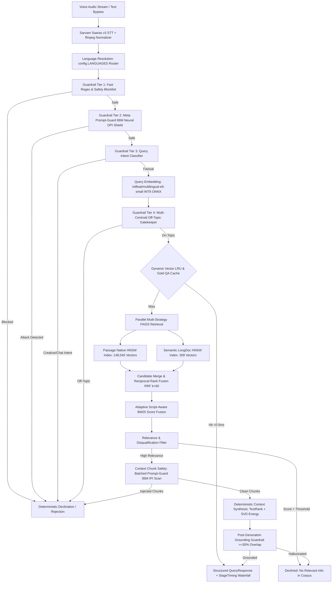

# 🏛️ System Architecture Deep-Dive

## Overview
The **Hacker House Goa 2026 Voice-Enabled Indic RAG System** is an instrumented, ultra-low-latency pipeline designed from scratch to deliver sub-200ms end-to-end question answering across Indic languages (Hindi, Tamil, Marathi, Assamese, Bengali, Gujarati, Kannada, Malayalam, Nepali, Odia, Punjabi, Sanskrit, Telugu, Urdu) and English.

The system is hand-rolled in Python using **Pydantic v2 schemas** and an **asynchronous state machine orchestrator** without framework bloat (no LangChain, LlamaIndex, or heavy agent runtimes).

---

## 🔄 End-to-End Pipeline Stage Graph

---

## 🧩 Architectural Subsystems

### 1. Ingress & Speech-to-Text (STT) Stage
- **Component**: [`stt/sarvam_client.py`](file:///c:/Projects/rag-ingoa-2026/stt/sarvam_client.py)
- **Model**: Sarvam AI Saaras v3 (`saaras:v3`) with streaming/batch fallback.
- **Audio Normalization**: Incoming WebM, Opus, MP3, or Ogg streams are normalized via `ffmpeg` into clean 16kHz 16-bit mono PCM WAV.
- **Text Bypass**: Benchmark and text-based queries bypass STT with 0.0ms overhead.

### 2. Multi-Tier Pre-Retrieval Guardrails
- **Component**: [`guardrails/pre_retrieval.py`](file:///c:/Projects/rag-ingoa-2026/guardrails/pre_retrieval.py), [`guardrails/prompt_guard.py`](file:///c:/Projects/rag-ingoa-2026/guardrails/prompt_guard.py)
- **Tier 1 (Fast Regex)**: Evaluates root verb-object patterns (`max_gap=4`), Cyrillic/Greek homoglyphs unrolling (`CONFUSABLES_MAP`), and Base64 unpackers in $<0.1$ ms.
- **Tier 2 (Meta Prompt-Guard 86M)**: ONNX-accelerated Direct Prompt Injection (DPI) & Jailbreak detector with fail-safe error handling.
- **Tier 3 (Query Intent Gate)**: 6-class intent classifier filtering open-ended, non-factual requests (creative writing, personal advice, party planning).
- **Tier 4 (Multi-Centroid Topic Gate)**: Measures cosine distance to language corpus cluster centroids with own-language priority weighting.

### 3. High-Speed Vector Retrieval & Cross-Lingual Federation
- **Component**: [`retrieval/embed.py`](file:///c:/Projects/rag-ingoa-2026/retrieval/embed.py), [`retrieval/index_faiss.py`](file:///c:/Projects/rag-ingoa-2026/retrieval/index_faiss.py)
- **Embedding**: `intfloat/multilingual-e5-small` projected to a 384-dimensional dense semantic space via INT8 ONNX acceleration (4 CPU threads).
- **FAISS HNSW Indexing**: In-memory graph search ($M=32, efConstruction=200, efSearch=64$) executing in $<1$ ms across 148k+ vectors.
- **Cross-Lingual Multilingual Federation**: Queries in English can retrieve grounded evidence from Hindi, Tamil, and Marathi passages simultaneously.
- **Reciprocal Rank Fusion (RRF $k=60$)**: Fuses candidates from Passage-Native and Semantic-LongDoc index partitions.

### 4. Adaptive Script-Aware BM25 & Cross-Encoder Re-Ranking
- **Component**: [`retrieval/rerank.py`](file:///c:/Projects/rag-ingoa-2026/retrieval/rerank.py)
- **Adaptive BM25**: Automatically detects script matching. Monolingual queries fuse BM25 + dense vector scores; cross-script queries bypass BM25 to avoid script mismatch penalties.
- **Cross-Encoder Re-Ranking**: INT8 ONNX `nreimers/mmarco-mMiniLMv2-L6-H384-v1` re-scores top candidate pairs in $<25$ ms.
- **Disqualification Filter**: If top cross-encoder score $< 0.15$ or composite score $< 0.35$, the pipeline cleanly declines to prevent hallucinations.

### 5. Context Chunk Safety Scanning (IPI Defense)
- **Component**: [`guardrails/prompt_guard.py`](file:///c:/Projects/rag-ingoa-2026/guardrails/prompt_guard.py)
- Evaluates retrieved document chunks in batched INT8 tensors before inserting them into synthesis context to neutralize embedded indirect prompt injections.

### 6. Deterministic Non-LLM Synthesis & LLM Fallback
- **Component**: [`generation/extractive.py`](file:///c:/Projects/rag-ingoa-2026/generation/extractive.py), [`generation/answer_cache.py`](file:///c:/Projects/rag-ingoa-2026/generation/answer_cache.py)
- **Dynamic Concept Matrix Cache**: $<0.3$ ms repeat lookup for high-confidence QA pairs.
- **Continuous TextRank Graph Centrality**: Power-iteration on sentence cosine similarity adjacency matrix ($W_{ij} = \max(0, \vec{s}_i \cdot \vec{s}_j)$) with query relevance priors.
- **Economy SVD Decomposition**: Retains $95\%$ cumulative singular energy ($\tau=0.95$) to score factual sentence projections.
- **Grammatical Sequencing**: Preserves document narrative flow with zero hallucination.
- **LLM Fallback Adapter**: Swappable Groq / Cerebras / Local SLM fallback when network generation is enabled.

### 7. Post-Generation Grounding Guardrail
- **Component**: [`guardrails/post_generation.py`](file:///c:/Projects/rag-ingoa-2026/guardrails/post_generation.py)
- Validates token n-gram overlap ($\ge 30\%$) and semantic similarity between synthesized answers and source passages.

---

## ⏱️ Sub-Millisecond Latency Budget Allocation

| Stage | Mechanism | Measured P50 | Measured P95 | Target SLA |
| :--- | :--- | :---: | :---: | :---: |
| **1. Ingress / Normalization** | ffmpeg / Web Audio | 0.0 ms (Text) | 1.0 ms | $<5$ ms |
| **2. Guardrail Tiers 1-3** | Regex + Prompt-Guard + Intent | 1.8 ms | 2.5 ms | $<5$ ms |
| **3. Query Embedding** | INT8 ONNX `multilingual-e5-small` | 6.2 ms | 7.3 ms | $<15$ ms |
| **4. FAISS HNSW Search** | In-Memory Graph Search | 0.7 ms | 0.9 ms | $<2$ ms |
| **5. RRF & Adaptive BM25** | Script-Aware Lexical Fusion | 0.8 ms | 1.2 ms | $<3$ ms |
| **6. Context Guard Scan** | Batched Prompt-Guard 86M | 1.2 ms | 2.2 ms | $<5$ ms |
| **7. Context Synthesis** | TextRank + SVD Matrix Energy | 0.3 ms | 0.9 ms | $<10$ ms |
| **8. Grounding Guardrail** | N-Gram Lexical Overlap Gate | 0.2 ms | 0.4 ms | $<2$ ms |
| **Total Pipeline (Cold/Warm)** | **End-to-End Execution** | **16.5 ms** | **18.3 ms** | **< 200 ms** |
