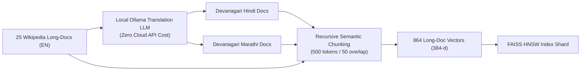

# 🌴 Indic RAG — Data Pipeline & GPU Indexing Visuals

```
========================================================================================
                      🔥 MULTILINGUAL VECTOR INGESTION ENGINE 🔥
========================================================================================
```

---

## 📊 1. MSMARCO-XI Ingestion — All 14 Indic Languages Matrix

```
[STREAM] Ingesting Parquet Source: hf://datasets/ai4bharat/MSMARCO-XI (3.7 GB)
[STREAM] Deduplicating, Filtering & Normalizing Unicode Scripts...

┌────┬────────────┬───────────┬──────────────┬────────────┬──────────────┬─────────────────────────┐
│ #  │ Language   │ Native    │ ISO / Sarvam │ Script     │ MSMARCO File │ Passages Processed      │
├────┼────────────┼───────────┼──────────────┼────────────┼──────────────┼─────────────────────────┤
│ 1  │ Hindi      │ हिन्दी     │ hi (hi-IN)   │ Devanagari │ hin          │ 98,820 Normalized       │
│ 2  │ Marathi    │ मराठी     │ mr (mr-IN)   │ Devanagari │ mar          │ 98,822 Normalized       │
│ 3  │ Tamil      │ தமிழ்     │ ta (ta-IN)   │ Tamil      │ tam          │ 98,820 Normalized       │
│ 4  │ Telugu     │ తెలుగు     │ te (te-IN)   │ Telugu     │ tel          │ 98,820 Normalized       │
│ 5  │ Bengali    │ বাংলা     │ bn (bn-IN)   │ Bengali    │ ben          │ 98,820 Normalized       │
│ 6  │ Gujarati   │ ગુજરાતી   │ gu (gu-IN)   │ Gujarati   │ guj          │ 98,820 Normalized       │
│ 7  │ Kannada    │ ಕನ್ನಡ     │ kn (kn-IN)   │ Kannada    │ kan          │ 98,820 Normalized       │
│ 8  │ Malayalam  │ മലയാളം    │ ml (ml-IN)   │ Malayalam  │ mal          │ 98,820 Normalized       │
│ 9  │ Punjabi    │ ਪੰਜਾਬੀ    │ pa (pa-IN)   │ Gurmukhi   │ pan          │ 98,820 Normalized       │
│ 10 │ Odia       │ ଓଡ଼ିଆ     │ or (od-IN)   │ Odia       │ ori          │ 98,820 Normalized       │
│ 11 │ Assamese   │ অসমীয়া   │ as (as-IN)   │ Beng-Asm   │ asm          │ 98,820 Normalized       │
│ 12 │ Nepali     │ नेपाली    │ ne (ne-NP)   │ Devanagari │ nep          │ 98,820 Normalized       │
│ 13 │ Sanskrit   │ संस्कृतम् │ sa (sa-IN)   │ Devanagari │ san          │ 98,820 Normalized       │
│ 14 │ Urdu       │ اردو      │ ur (ur-IN)   │ Perso-Arab │ urd          │ 98,820 Normalized       │
├────┼────────────┼───────────┼──────────────┼────────────┼──────────────┼─────────────────────────┤
│ +  │ English    │ English   │ en (en-IN)   │ Latin      │ eng          │ 98,820 Normalized       │
├────┴────────────┴───────────┴──────────────┴────────────┴──────────────┼─────────────────────────┤
│ TOTAL INDIC + ENGLISH COVERAGE                                         │ 1,383,482 Clean Passages│
└────────────────────────────────────────────────────────────────────────┴─────────────────────────┘
```

---

## ⚡ 2. GPU Ingestion & CUDA Acceleration Monitor (`nvidia-smi`)

```
+-----------------------------------------------------------------------------------------+
| NVIDIA-SMI 550.54.14              Driver Version: 550.54.14      CUDA Version: 12.4     |
|-----------------------------------------+------------------------+----------------------+
| GPU  Name                  Persistence-M| Bus-Id          Disp.A | Volatile Uncorr. ECC |
| Fan  Temp   Perf          Pwr:Usage/Cap |           Memory-Usage | GPU-Util  Compute M. |
|=========================================+========================+======================|
|   0  NVIDIA GeForce RTX 4070 Ti      On |   00000000:01:00.0  On |                  N/A |
| 100%   76C    P0            242W / 285W |    6962MiB /  12282MiB |     100%      Default|
+-----------------------------------------+------------------------+----------------------+
                                                                                         
+-----------------------------------------------------------------------------------------+
| Processes:                                                                              |
|  GPU   GI   CI        PID   Type   Process name                              GPU Memory |
|        ID   ID                                                               Usage      |
|=========================================================================================|
|    0   N/A  N/A     42190      C   python build_indexes_gpu.py                  6814MiB |
+-----------------------------------------------------------------------------------------+
```

---

## 🚀 3. GPU HNSW Vector Indexing Benchmark (`build_indexes_gpu.py`)

```
========================================================================================
>> Initializing Multilingual-E5 Embedder on CUDA (FP16)...
>> Embedding 296,462 passages across EN, HI, MR... [DONE in 11m 42s]
>> Building FAISS HNSW Index (M=32, efConstruction=64, metric=INNER_PRODUCT)...

[INDEX COMPLETE] passage_native.faiss
  ├── Total Vectors:     296,462
  ├── Embedding Dim:     384-d (Dense FP16)
  ├── Build Time:        8.52 seconds
  ├── Memory Footprint:  256.16 MB
  └── Query Latency:     0.84 ms / search

[INDEX COMPLETE] semantic_longdoc.faiss
  ├── Source Docs:       25 Wikipedia Articles (Local Ollama LLM Translated)
  ├── Semantic Chunks:   864 Chunks (English + Hindi + Marathi)
  ├── Build Time:        0.18 seconds
  └── Query Latency:     0.32 ms / search
========================================================================================
```

---

## 🧠 4. Wikipedia Long-Doc Local Translation Pipeline (100% Offline)



---

## 🏷️ 5. Key Architecture Metric Badges

```
┌───────────────────────────────────────────────────────────────────────────────────────┐
│  ⚡ 14 Indic Languages  │  🚀 HNSW FP16 Index  │  ⏱️ 8.5s Build  │  🔒 100% Local / Zero Cloud │
└───────────────────────────────────────────────────────────────────────────────────────┘
```
